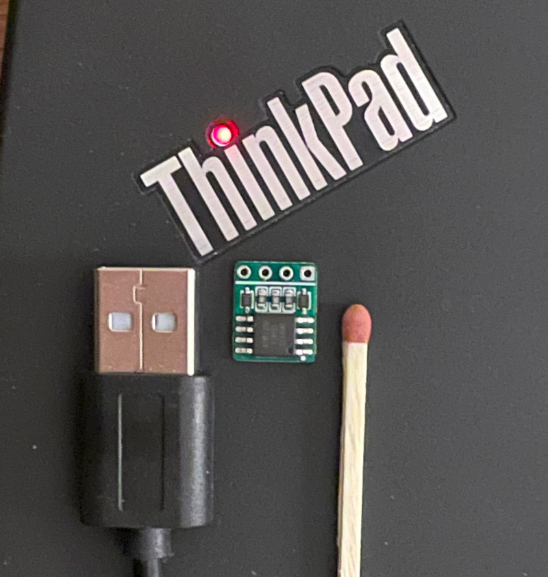
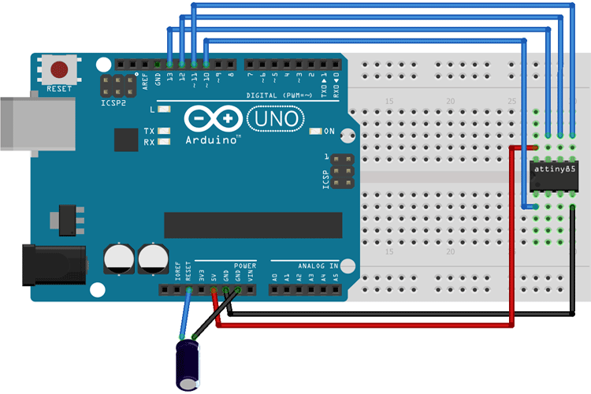
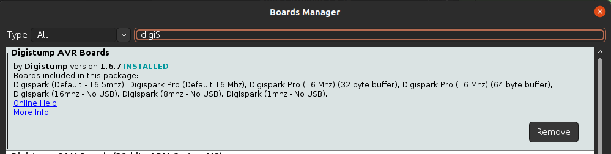

# HiDIYous

Its a Diy HID Implant that you can implant in whatever! With a size of 10x11mm (The PCB Manufacturer cant do anything smaller than 10x10, but it is _possible_ to reduce to 10x7mm but that is an excercise for the reader)



# Howto
- Installed Arduino IDE
- ArduinoUNO or ISP Programmer
    - Jumper cables x6
    - 10uF Capacitor
    - (optional) SOIC-8 Clip
- USB Breakout cable, either Buy or DIY (I went with the DIY route)
- Installed avrdude

## Hardware
Based around ATTiny85 and DigiKeyboard library, Designed in EasyEDA.

Order a assembled PCB from [JLCPCB.com](https://cart.jlcpcb.com/quote?orderType=1&stencilLayer=2&stencilWidth=100&stencilLength=100)

- TODO Gerber file: `hardware/Gerber.zip`
- Bill Of Materials: `hardware/BOM.csv`
- Pick and Place: `hardware/PP.csv`

Pick preferred color, and PCB Thickness (Recommended 1.0mm)

## ArduinoUNO
Insert your Arduino UNO into the computer, and upload the sketch `ISP Programmer` found under examples.  
ArduinoISP: `File > Examples > 11.ArduinoISP > ArduinoISP`  
Compile and Upload to the UNO

Docs: [ArduinoISP](https://docs.arduino.cc/built-in-examples/arduino-isp/ArduinoISP)

### ISP Programming Pinout:



## Flash Bootloader
This example is using an ArduinoUNO as a ISP programmer, _YMMV_ with other hardware.

```bash
# Setting the correct fuses for bootloader burnin
avrdude -c arduino -p attiny85 -P /dev/ttyACM1 -b 19200 -Uflash:w:"software/bootloader.hex":i -U lfuse:w:0xe1:m -U hfuse:w:0xdd:m -U efuse:w:0xfe:m
```

## Arduino IDE PCB Setup
Add the following url to the Arduino IDEs additional boards url
`http://digistump.com/package_digistump_index.json`

Then go to `Tools > Board > Boards manager`  
Search for Digispark and install the package: `Digistump AVR Boards`



## Replace micronucleus for Arduino IDE
The digistump library is shipped with a faulty micronucleus binary for v2.3 bootloader, a working binary is included in this repo `software/micronucleus`

Locate the arduino packages folder and browse to 
`~/.arduino15/packages/digistump/tools/micronucleus/2.0a4/micronucleus`
Replace the micronucleus with the included binary

## Upload code
Open the file `software/inject.example.ino` into the Arduino IDE, and select the board configuration `Tools > Board > Digistump AVR Boards > Digispark Default (16.5MHz)`.  

Upload the code with the regular Arduino IDE workflow

Setup the pinout according to the chip silkscreen

Now you are finished and are ready to implant it into whatever USB Peripheral you want.